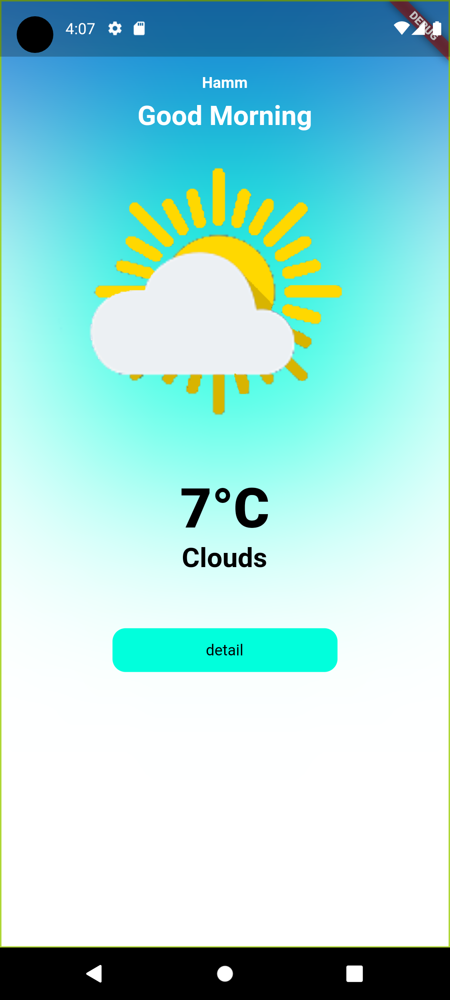

# Weather App

## Description
  simple weather app
  <p align="center">
    
  
</p>


## Features

- **Real-time Weather Data**: The app displays the latest weather information for your location.

## Technologies Used

- Flutter
- flutter_bloc
- Dart
- geolocator
- intln
- [OpenWeather API](https://openweathermap.org/api) for weather data


## API Key

To fetch weather data for the app, you'll need a free API key from OpenWeather. Copy your key and paste it in the `data/myData.dart` file.

```dart
// myData.dart
String API_KEY ="YOUR_API_KEY_HERE";

